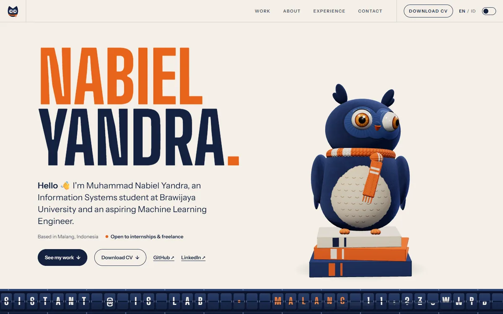

# nabiel-portofolio

My personal portfolio. It's where I keep track of what I'm learning, where I've contributed, and the things I build.

▶ **Visit it here: [nabiel-portofolio-five.vercel.app](https://nabiel-portofolio-five.vercel.app/)**



Hi, I'm Nabiel, an Information Systems student at Brawijaya University in Malang, Indonesia. I'm a resident and teaching assistant at the Intelligent System Laboratory, and I'm working my way toward AI/ML engineering and data science. I wanted a site that feels like that path: a little bit of system design, a little bit of data, and a neural network you can actually poke at.

## What's on the page

- **Hero.** A small neural network built in Three.js sits behind my name. It slowly drifts, sends signals forward from layer to layer, and the neurons near your cursor light up and fire.
- **"Training" intro.** The site opens with a counter going from 0 to 100 like a model training run, then the curtain lifts.
- **About, Education and Experience.** My background, the lab and organizations I'm part of, and a timeline styled like a BPMN process (a nod to my Information Systems classes).
- **Skills.** A bento grid of the tools I use, plus a scrolling ticker that leans with your scroll speed.
- **Projects.** The things I've built, from a typing game to NLP and data analysis, filterable by category.
- **Contact.** Copy my email in one click, with my local time (WIB) shown next to it.

It's fully bilingual (English and Bahasa Indonesia) and has both a dark and a light theme.

## Built with

- [React 19](https://react.dev/) and [Vite](https://vite.dev/)
- [Three.js](https://threejs.org/) with [React Three Fiber](https://r3f.docs.pmnd.rs/) for the hero scene
- [Framer Motion](https://motion.dev/) for animations
- [Lenis](https://lenis.darkroom.engineering/) for smooth scrolling
- Plain CSS Modules with design tokens (no CSS framework)
- Hosted on [Vercel](https://vercel.com/)

## Keeping it smooth

A live WebGL scene on a landing page can easily make everything else feel heavy, so I spent some time on this:

- The intro counter waits until the 3D scene and fonts are ready before it starts, so the count never stutters halfway.
- The curtain and the hero entrance run on the GPU compositor, so they stay smooth even while the page is still busy loading.
- The network's geometry is updated every frame, so its buffers are marked as dynamic. On Windows that alone made the canvas about 30 times cheaper to draw.
- The center dot of the custom cursor is a real system cursor image, so it never lags behind your mouse. Only the bracket around it is animated.

## Running it locally

You'll need [Node.js](https://nodejs.org/) 20.19+ or 22.12+ (what Vite 8 requires).

```bash
npm install
npm run dev       # http://localhost:5173
```

Other scripts:

```bash
npm run build     # production build into dist/
npm run preview   # serve the production build locally
npm run lint      # ESLint
```

## Updating the content

All the content lives in plain data files, so updating the site rarely means touching a component.

| What | Where |
| --- | --- |
| Name, email, social links, CV | `src/data/profile.js` |
| Projects and filter categories | `src/data/projects.js` |
| Experience timeline | `src/data/experience.js` |
| Education and affiliations | `src/data/education.js` |
| Skills and ticker | `src/data/skills.js` |
| Interface text (EN / ID) | `src/i18n/en.js` and `src/i18n/id.js` |

A few notes:

- **Projects.** Pick a category (`ai-ml`, `data-science`, `web-dev` or `fun`), or an array of them if a project fits more than one, and add a `{ en, id }` description. Project screenshots go in `public/projects/` (WebP works best). If `image` is left empty, a generated cover matching the category is drawn instead.
- **CV.** Put the PDF in `public/cv/` and set `cv` in `profile.js` to its path, e.g. `'/cv/CV_Muhammad_Nabiel_Yandra.pdf'`. The download button shows up on its own.
- **Text.** Anything that appears on the page should be added to both `en.js` and `id.js`.

Every push to `main` is deployed to Vercel automatically.

## Get in touch

- Email: [nabielyandra@gmail.com](mailto:nabielyandra@gmail.com)
- LinkedIn: [in/nabiel-yandra](https://linkedin.com/in/nabiel-yandra)
- GitHub: [@nabielyr](https://github.com/nabielyr)
- Linktree: [linktr.ee/nabielyandra](https://linktr.ee/nabielyandra)
